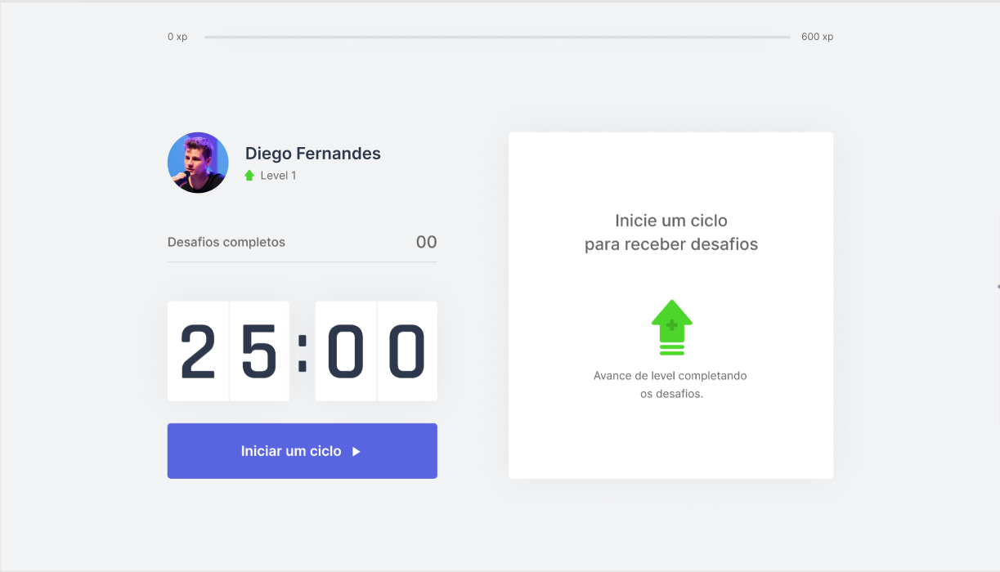

<h1 align="center">🥇 MOVE-IT 🏃‍</h1>
<h3 align="center">🏆 NEXT LEVEL WEEK 4 🏆</h3>

### 🤔 O que é o Next Level Week?

Criado pela Rocketseat, o NLW é uma semana prática com muito código, desafios, networking e um único objetivo: te levar para o próximo nível.

Através do nosso método você aprende novas ferramentas, conhece novas tecnologias e descobre hacks que impulsionão a sua carreira.

Um evento online e totalmente gratuito que te ajuda a dar o próximo passo na sua evolução como dev.

_________

### ✨ Sobre o projeto:

<p align="center">

</p>

O MoveIt é uma aplicação web que tem a ideia de te fornecer ciclos de trabalho com foco, e ao final de cada ciclo você recebe um desafio para exercitar seu corpo. Conforme você completa os ciclos e desafios, você ganha experiência e sobe de level.

_________

## 💡 Tecnologias

Esse projeto foi desenvolvido com as seguintes tecnologias:

- [React](https://reactjs.org)
- [TypeScript](https://www.typescriptlang.org/)
- [SQLite](https://www.sqlite.org/index.html)
- [React Native](https://facebook.github.io/react-native/)

_________

## 💻 Projeto

<p style="margin-left:5em">🌍 <b>Web</b>&nbsp;&nbsp;&nbsp;&nbsp;./web - Interface web em ReactJS e TypeScript </p>

_________

## 📝 Instalações e usos

Clone ou faça o downlod desse repositório:

```
# Clone o repositório
$ git clone https://github.com/LucasCancio/MoveIt-nlw04
```

Acesse a pasta web e faça as instalações:

```
# Acesse a pasta do frontend
$ cd web/

# Instale as dependencias
$ npm install

# Rode 
$ npm start

# running on port 3000
```

_________


## ❤ Agradeço muito a [Rocketseat](https://rocketseat.com.br/)
